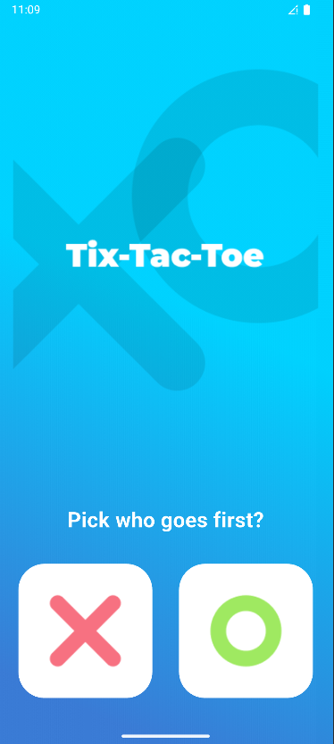
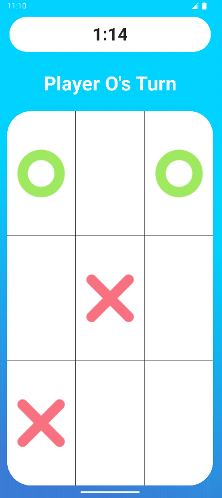

XO Game 🎮
A simple and fun Tic-Tac-Toe game built with Flutter.
This project combines clean UI, smooth navigation, and solid game logic to deliver a polished gaming experience.

## Getting Started
✨ Features
🎯 Choose who starts → X or O from the start screen
🎨 Stylish UI with a custom background and responsive design
⏱️ Real-time timer to track the duration of each match
🏆 Winner detection with a popup to celebrate the winner
🔄 Auto reset to start a new game instantly
📱 Fully responsive layout

🚀 Tech Stack
Flutter – UI development
Dart – Core logic

---

## 📸 Screenshots

| Home Screen | Play Screen |
|---------------|----------------|
|  |  |
